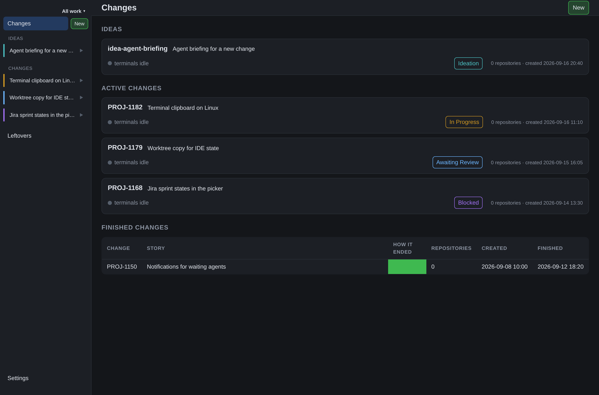

# Corvi

[](https://github.com/wwbakker/corvi/actions/workflows/ci.yml)

**An agent-ready development environment for a change.** Corvi is a local dashboard for a
*change*: the work spanning one or more repositories, plus the worktrees, pull requests, tickets
and builds around it — and the terminals where you and your agents do the work. Everything is
read live from the vendors' own CLIs — and, for Jira, from its REST API — so Corvi owns no copy
of their data. The one secret it can hold is a Jira token you choose to type into the settings
page: kept in your own config file, masked in the interface, and readable from the file only by
you.



A change begins as an **idea** — a title, a plan, and a conversation with an agent — and becomes
work when you start it: Corvi cuts a branch and worktree per repository and moves the ticket. Its
state lives in one directory per change (`~/corvi/changes/<id>/`), and the archive keeps the
finished ones.

## Install

Corvi runs on macOS and Linux. It needs `git`, `gh`, `az` and `tmux` for the integrations and the
terminals, and [Bun](https://bun.sh) plus Node 24+ to build the page.

```bash
git clone https://github.com/wwbakker/corvi.git
cd corvi
bun install
bun run app:install
```

`app:install` puts a real window on your machine — `~/Applications/Corvi.app` on macOS; a desktop
entry, an icon and a `corvi` launcher on Linux — that starts its own server on a fresh port and
stops it when the window closes. Quitting it never touches a server you started yourself.

To run it from the checkout instead:

```bash
bun run dev          # http://127.0.0.1:4000
```

There is no account and no cloud: Corvi is your machine, your CLIs and your credentials. The
first run has the settings page at `/settings` for the paths and integrations, and
[the manual](docs/manual/install.md) has the details.

## Documentation

- [Installing and running](docs/manual/install.md) — requirements, the app, Linux, uninstalling.
- [Configuration](docs/manual/configuration.md) — the config file, environment variables,
  settings, workspaces.
- [Changes](docs/manual/changes.md) — ideas, repositories, worktrees, states, completing.
- [The interface](docs/manual/interface.md) and [terminals](docs/manual/terminals.md).
- [Integrations](docs/manual/integrations.md) — Jira, Azure DevOps, GitHub, review.
- [Architecture](docs/guides/architecture.md), [API design](docs/guides/api-design.md), and the
  other [contributor guides](docs/README.md).

The architecture guides define the accepted layout, and the implementation matches it: the
application is `apps/server`, `apps/web` and `apps/desktop`, shared capabilities are `packages/*`,
provider integrations are `integrations/*`, and `bun run boundaries` enforces the graph. There is
no third-party extension platform.

## Development

```bash
bun run dev          # the server, with the page built first
bun run dev:web      # watch the page and rebuild as you edit
bun run test         # the full suite with isolated data and owned-resource cleanup
bun run typecheck && bun run lint
```

The page is built ahead of time: `bun run build:web` writes `apps/web/dist`, and the server
serves it (`bun run dev` builds first).

[`CONTRIBUTING.md`](CONTRIBUTING.md) and [`AGENTS.md`](AGENTS.md) hold the working rules;
[`docs/`](docs/README.md) explains how the documentation is split.

## License

MIT — see [`LICENSE`](LICENSE).
