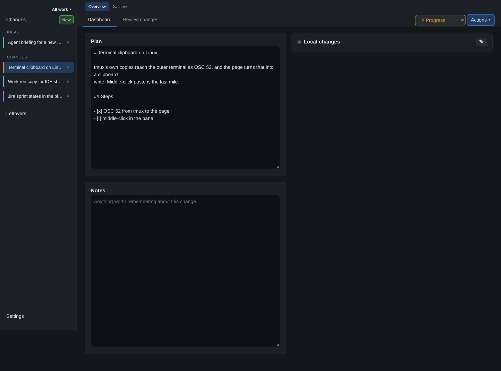

# Changes



## Creating an idea

**New** — the same button the column has, beside `Changes` — opens a wizard whose steps are its
extensions', in phases — the issue steps first (they prefill the idea), then the idea details, then
the repositories, then steps that want the repositories. Which steps a context has is resolved per
workspace; an extension that is not enabled there has no step, not an empty one.

1. **Jira** — a table of every issue in the open sprints plus the un-sprinted backlog, grouped
   by sprint (collapsible), sorted by assignee, then status, then key, and filterable by
   key/summary, assignee and sprint. Each row links to the issue in Jira. "Create new issue"
   opens a dialog for title and description; the new issue (assigned to you, type from
   `CORVI_JIRA_ISSUE_TYPE`, default `Story`) is selected straight away. Skipping the step is fine:
   you can name the change yourself.
2. **GitHub issue** (after the repositories) — the open issues of the repositories picked on the
   step before, from the GitHub remote each one pushes to; a repository without one says so.
   Pick an issue or create one (`gh` does it, in the first selected repository); the picked
   issue prefills the change, names it on the overview, shows on the dashboard as its own card
   and is closed when the change completes. Both this step and the Jira step can be on at once:
   two tickets on one change is a thing, not a conflict.
3. **Idea** — Title (which the id and branch follow: "Ideation Stage" becomes `ideation-stage`),
   Description (the starting text of `PLAN.md`), Change id and Branch name (both editable, and both
   stop following the title once you touch them), and the Ticket the issue step picked. Skipping the
   issue steps is fine: type a title and you have an idea.
4. **Repositories** (optional) — from a directory browser rooted at `reposRoot`. Clicking a name
   browses into it, the button beside it adds it to the selection: a directory that is both a
   repository and a parent of repositories (`acme/services`) can be either. Selected repositories
   are listed on the right and removed with the cross. A repository picked now is linked into the
   change directory for reading, without switching its branch or creating a worktree; **Start
   work** turns that link into the checkout, so an idea that never starts leaves no branch behind.

Creating an idea writes `change.json` and `PLAN.md` and provisions nothing else: no branch, no
worktree, and no ticket transition. Its page has a **Plan** card — editable, the same `PLAN.md`
the agent reads, and still there (read-only once the change is finished) when the work starts —
and a **Brief the agent** button that pastes the configured prompt into the change's terminal. **Start work** is the one action that leaves the ideation stage: it moves the
state to `In Progress`, creates each repository's checkout (in place or a worktree, as the
repository list says), and moves the ticket.

Each step's pick is stored on the change under the step's extension's name — `change.json`'s
`extensions` bag — so completing the change knows what to close, and the core never had to know
what a ticket was.

Only issue types in `CORVI_JIRA_ISSUE_TYPES` (default `Story,Bug`) are listed: epics and subtasks
are containers, not units of work. A change may still link to any type directly.

Which sprints the table covers comes from `CORVI_JIRA_SPRINT_STATES` (default `active,future`). An
issue's sprint is which query found it rather than a field on it, so the table is built from one
call per sprint plus one for the backlog, cached for 60s.

The dashboard shows three widgets, in this order:

- **Jira** — the issue, its status and assignee. No transition buttons: `In Progress` is set when
  the change is created, and `Done` belongs to completing the change as a whole.
- **Local changes** — the worktree per repository: clean or dirty, ahead/behind, merged.
  Reviewing and committing what is uncommitted here is the **Review changes** tab, below.
- **GitHub** — per repository, the pull request and the checks it reports: "is this
  change green?", from GitHub's side. Rows form a collapsible tree, with the checks grouped by
  the part of the name before the bracket.
- **Azure DevOps** — per repository, the pipeline runs it triggered, beside the GitHub card.
  Rows form a collapsible tree:

      example-api
      └─ #719 Fix the thing
         ├─ build-example-api                2 run(s)
         │  ├─ 20260818.3                   succeeded
         │  └─ 20260818.2                   succeeded
         └─ deploy-example-api               no runs for this branch

  A pull request row shows unresolved review threads in amber (`gh api graphql`, since neither
  `gh pr list` nor the REST API exposes resolution state) *and* the review decision, so
  `1 unresolved comment · approved` is visible as its own state. Resolved threads are not
  mentioned; `ready to merge` is reserved for an approval with nothing left open.

  Counted are the threads **waiting on you**: unresolved, and not last spoken in by you. Only the
  reviewer can resolve a thread, so a thread you answered stays unresolved for as long as they
  take to look at it — counting those made the number say you had work when you had none. Your
  own login comes from `viewer{login}` in the same query, so it costs no extra call. A thread
  whose last author cannot be read counts, since the safe answer to "is this mine?" is yes.

  The pull request is looked up by the branch that was **pushed**, not by the change's branch
  name: a branch that was renamed, or made around work that already existed, lives on the remote
  under another name, and the pull request belongs to that one. When the two differ the row says
  `pushed as <branch>`, because it is worth knowing. A branch still tracking `origin/main` is
  ignored — that is a mistake, not a pull request.

  A pull request that belongs to a GitHub stack says so: `1 of 2 in stack #163`, read in the same
  GraphQL query as the unresolved comments, so it costs no extra call. Where the preview feature
  is not enabled the query is repeated without those fields rather than losing the comment counts.

  The GitHub card always shows the checks the pull request itself reports — GitHub Actions,
  Azure Pipelines in any project, whatever the repository has bolted on — grouped by the part of
  the name before the bracket, so a build with thirty jobs
  (`owner.frontend-app (CI App @scope/one-app)`) is one row you can open. The Azure DevOps
  card stays silent for a repository its pipelines do not know about: no row at all, rather than
  a row saying so.

  A pipeline's own dot follows its **newest** run: an older failure that a later run fixed does
  not keep the pipeline, the repository or the whole card red. The failed run keeps its red dot
  in the list, where it belongs.

  A successful run also shows the artifact version its pipeline printed
  (`Version is: '…'`, `pushing manifest for …`, `Built and pushed image as …`, the patterns from
  a shell script that read the same lines). Logs are searched newest step first, five at a time,
  and the answer is cached per run id: a finished build's logs never change.

  A run still in flight shows the time it has been busy and a bar against the mean duration of
  that pipeline's last `CORVI_AZURE_HISTORY` (default 10) finished runs, across branches. The clock
  ticks in the browser, so it stays smooth between the widget's 15s refreshes, and an overrun
  fills the bar and keeps counting.

  Azure DevOps reports `repository.name` as null, so pipelines are attributed to a repository by
  their pipeline folder (`\example-api`), which mirrors the service directories of a
  monorepo. Runs are looked up on both the pull request merge ref and the branch: validation
  builds run on the former, CI-triggered pipelines (publishing a client, say) on the latter. `CORVI_AZURE_RUNS` (default 3) caps the runs shown per pipeline.

The dashboard's left column holds the change's documents — the plan, and Notes — while every
status card sits to the right. On a window narrower than 1280px the two columns stack,
documents first.


## Opening a repository

Every repository row in **Local changes** has a ⋯ menu: **Open in IntelliJ** and **Open in
Finder** (on Linux, **Open in Files** — the desktop's file manager). macOS opens through `open`,
by application name; Linux goes through `xdg-open`, with IntelliJ via its `idea` launcher script,
which only offers the menu item when it is on the path. IntelliJ receives the project rather than being launched again, so where it lands — new
window, current window, or a prompt — is whatever *Settings > Appearance & Behavior > System
Settings > Open project in* says. The worktree is opened when there is one, the repository itself when it is used in
place.

## Changing which repositories a change touches

The pencil in the corner of the **Local changes** widget opens the repository list in the
wizard's browser. Adding and removing there only edits a draft; `OK` applies the whole list at
once and `Cancel` throws it away, so nothing is created or deleted while you are still deciding.

Applying an edit creates a worktree per added repository and removes one per dropped repository:

- clean worktree — removed straight away;
- unpushed commits — removed after a confirmation, since the checkout goes but `wt` keeps the
  branch, so the commits remain reachable;
- uncommitted changes — the whole edit is refused, naming the repositories: revert or commit
  first. The server enforces this, not the dialog.

## Worktree or in place

Each selected repository carries two choices, made in the boxes under its path:

**How it is worked on** — one of two ways:

- **Worktree** — a separate checkout on the change's branch inside the change directory. The
  repository you browsed from keeps whatever it was doing.
- **In place** — the repository's own checkout is switched to the change's branch (created from
  the remote default, after a fetch) and symlinked into the change directory, so the change
  directory still lists everything the change touches.

The list may also be emptied. A change with no repositories is not much of a change, but it is a
step on the way to one: taking a repository out and putting it back is how you get a fresh
worktree when the one you have is beyond saving, and refusing the empty middle made the whole
manoeuvre impossible. Creating a change still needs at least one — that is a decision about what
the work *is*, not a step in the middle of it. What a removal protects is unchanged: uncommitted
work refuses outright, unpushed commits ask first.

A repository with uncommitted work is linked but not switched: the card says which branch it is
on and offers the switch again once you have committed or stashed. Removing an in-place
repository, or completing the change, removes only the link — your checkout and its branch stay
exactly where they were.

**What it starts from** — the second box lists the remote's branches, newest first, with the
default (`origin/main`) selected. Choosing another change's branch stacks this work on top of it:
the worktree branches off there, and `gh pr create` targets that branch, so the pull request shows
your commits alone rather than both changes' together. GitHub retargets it to `main` by itself
once the branch below merges — and since these repositories squash-merge, rebase afterwards with
`git rebase --onto origin/main <branch-below> <your-branch>` rather than merging `main` in.

When the branch below has a pull request of its own, Corvi also registers the two as a **GitHub
stack** (a public preview feature): the new pull request is appended to that stack, or a stack of
the two is created. Reviewers then see the order of the work, and merging the bottom one carries
the rest along. It is best effort — a repository without the preview feature, or a base branch
with no pull request, simply gets the correct base and nothing more.

Stacking is worth avoiding when you can simply wait for the change below to merge; two deep is
manageable, four is a research project every time the bottom one moves.

### What a new worktree inherits

A worktree is a checkout of the same repository, but to IntelliJ it is an unknown directory: no
`.idea` means the project is imported from scratch, and no `.bsp` means there is no build server
to import it with. So on creation Corvi copies those directories over from the repository —
`worktreeCopy` in the config, by default:

```
.idea  .bsp  .bloop  .scala-build  .metals  .vscode
```

**Only what the new worktree ignores is copied.** A worktree that does not ignore `.idea` gets an
untracked directory the moment it is made, and that is not cosmetic: it counts as dirty for ever,
so it cannot be removed, and the review tab offers our copy of somebody's IDE settings up for
committing. The question is asked of the worktree rather than of the repository it came from,
because they can disagree — a worktree branches from the remote default, which may not carry the
`.gitignore` your checkout has.

**The paths inside them are rewritten** to the new location, which is the whole point: a `.bsp`
copied unchanged points its build server at the main checkout, so the IDE would show you one
directory and compile another. Rewriting is careful about where a path is a path and where it is
only a prefix — `example-api` must not be rewritten inside `example-api-client`, and that is not
hypothetical: one repository here has a sibling's `bin` directory on the `PATH` in its
`.scala-build/ide-envs.json`, and a naive replacement corrupts it.

None of this is Corvi's state and none of it is in git; it is ignored, per-machine, and written by
other programs. It is copied once, at creation, and never touched again — a worktree that already
has a `.idea` keeps it, since the IDE has owned it since. Build outputs (`target`, `node_modules`)
are deliberately *not* copied: recreating them is a build, and a stale copy is worse than none.
Failing to copy is never fatal — the worktree is what was asked for.

`reposStart` in the config sets the directory the browser opens on; `↑ Up` still walks back to
`reposRoot`.


## Left behind

A page of its own, beside `Changes` in the navigation column when the leftovers extension is
enabled: the directories in the changes root that no longer belong to a
change — what a completed one left behind (a build's `target/`, a shell's history, the terminal's
note) or a change that was never finished being created. Each one opens to show what is in it,
with its size, and a Delete button. Nothing is removed on your behalf: `target/` is rubbish, the
scratch file next to it might not be.

Deletion refuses anything that still has a `change.json`, so an active change cannot be tidied
away by accident, and the archived copy of a completed change is untouched — only the directory
that outlived it goes.

Directories inside a leftover are labelled when git cares about them: `git worktree` for one still
registered with its repository, `git repository` for a clone with a history of its own. Both are
named in the confirmation, and after deleting a worktree the repository is pruned, so git does not
keep a registration for a path that is gone.

## The order things are listed in

Active changes, in the navigation column and on the overview, are sorted by **state first and then
newest first**:

```
Ideation          ← an idea, not started
In Progress       ← what you can get on with
Awaiting Review   ← what is with somebody else
Blocked           ← what is stuck
```

That is `CHANGE_STATES` itself, so there is one order and it is used twice: the state select
offers them in it, and the lists sort by it. Within a state the newest change is on top, because
that is the one you are most likely to be looking for.

Ideas are the one place that order is not read straight down: the overview and the navigation
column put them in a block of their own at the top, under an **Ideas** heading, because an idea is
a question where the rest is a job. `Ideation` still ranks first in `CHANGE_STATES`, so the block
and the order agree.

Finished changes — completed and cancelled — go to a table below, newest first, with a column
saying which of the two it was. A change that was abandoned is not one that landed, and that is
the first thing you want to know about a row down there.

`Settings` sits at the bottom of the navigation column rather than under the list: it is where you
go once in a while, and it should be in the same place whether you have two changes or nine.

## The overview

The front page is three lists, because they are read for different reasons: ideas you have not
started, work in flight, and what happened.

A change is named by **its ticket's summary** — "Anonymise customer names on the acceptance
environment" — rather than its branch, which says how the work is spelled and not what it is. A
change without a ticket shows its branch instead, in monospace, since that is an identifier and
reads as one.

The summary is stored in `change.json` the first time it is read, so the list carries it and the
page is complete the moment it loads; `GET /api/titles` then refreshes every change on the page
in **one** `jira` query and writes back what changed. A Jira that answers nothing — down,
unauthenticated, ticket deleted — leaves the stored name alone rather than falling back to a
branch nobody recognises, and an archived change keeps its name for good.

**The name is editable**: rename it from the Actions menu in the change's own row, which opens a
field for it beside the state. It is not in the window's own row, which says nothing about the
change at all. Type over it and it stops being refreshed from Jira. Renaming sets `titleEdited`,
and a change with that set is not asked about again — its ticket is left out of the query entirely,
so nothing overwrites your words later. Clearing the field hands the name back to Jira.

**Active changes** are cards, one per change and the full width of the page, in two rows: **what
it is** — the id and the ticket's summary, which read as one sentence — and underneath, **how it
is doing** — the facts on the left, state and dates on the right. A table row has no space for
the second row, which is the reason these are cards at all. Below 720px the bottom row becomes
as many lines as it needs. Besides the branch, the repository count and when it
started, each card carries three facts, fetched per card from `/api/changes/:id/summary`:

- `2 pipelines active` / `pipelines idle` — runs in flight across every repository.
- `2 terminal processes active` / `terminals idle` — tmux windows running something that is not
  a shell: a build, an editor, a server. An agent that marks its title is taken at its word, so
  one sitting at its prompt does not count.
- `3 unresolved comments` — threads waiting on you, as on the dashboard: unresolved and not last
  answered by you. **Nothing at all** when there are none: an empty inbox needs no line, and a
  row of zeroes is noise.

Idle facts are grey, so the eye lands on the cards that want something. One request per card,
because those numbers cost CLI calls: a change whose Azure DevOps is slow delays its own card and
no other. The queries behind them are the cached ones the dashboard already makes
(`activeRuns` skips durations, logs and versions; `prSummary` asks the pull request only for its
open threads), so a change you have open answers immediately.

**Completed changes** stay a table — id, story, repositories, created, completed. No state
column: every row in it is `Completed`, which is what the heading says.


## Cancelling a change

The other way a change ends, in the same menu as `Complete change`:

```
Cancel change    → the worktrees and the terminal go
```

Nothing anyone else can see is touched. The pull requests stay open, the ticket stays where it is,
and the branches stay wherever wt left them — cancelling is a decision about your own desk, and
closing somebody else's pull request or moving a ticket other people are watching is a decision
about theirs. What is left over is listed when it finishes:

```
Cancelled. Still open: PROJ-123 is still open in Jira; example-api #12 is still open;
the branch PROJ-123-work is kept in example-api
```

The branch line is worked out **after** the worktrees are removed rather than promised in advance,
because wt keeps a branch that has commits nobody else has and removes one with nothing on it.
That is the behaviour you want and not the one you would guess, so it is reported rather than
claimed either way.

The protections are a repository removal's, because it is the same act: **uncommitted work
refuses outright** (it exists nowhere else, and no dialog makes it recoverable), and **commits
that were never pushed ask once** (the branch survives, so they are recoverable — by someone who
knows the branch is there). The asking happens in a dialog rather than a `window.confirm`:
the first click opens it, confirming runs it, and a 409 naming the repositories fills in the
one acknowledge. The change is archived as `Cancelled`, and stays readable: what was
abandoned is worth being able to look up.

### After it ends

A finished change — completed or cancelled — keeps its dashboard, without the buttons. Its
worktrees are gone and its directory is in the archive, so `Create worktree` and the rest offer to
half-revive something that is over; the rows stay, because what a change touched is worth reading
afterwards, and so does the `⋯` menu, because opening one of its repositories still makes sense.
The action route refuses too, with a 409: the page may have been open since before the change
ended, and the server is where the truth lives.

## Change state

Every change carries one of `Ideation` (teal), `In Progress` (amber), `Awaiting Review` (blue),
`Blocked` (purple) or `Completed`/`Cancelled` (green/grey). The states you work in are chosen in
the select beside `Complete change`; `Ideation` is not one of them. It is set by creating an idea
and left by **Start work**, which is an action rather than a word in the list because starting
does more than change a label: it creates each repository's checkout and moves the ticket.

`Blocked` is waiting on something you cannot do yourself: an answer, a decision, another change.
That is a different thing from `Awaiting Review`, which is waiting on a named person to look at
work that is done, and the distinction is worth a colour because one of them is your problem to
chase and the other is not.

The state is kept by hand rather than derived, because the tools disagree often enough (a merged
pull request with the ticket still open, a review that happened in a call) that your own answer
is the useful one. Completing a change sets it to `Completed`. A change recorded without a state
reads as `In Progress`.

## Actions

The `Actions` button on a dashboard holds what you can do to the change as a whole:

- **Copy PR description** — puts the ticket and one link per repository on the clipboard:

      PROJ-123 - Anonymise customer names on the acceptance environment
      https://github.com/owner/example-api-service/pull/720
      https://github.com/owner/example-deploy/pull/135

  A repository whose pull request does not exist yet is listed by name, so the list stays
  complete.
- **Complete change** — last in the menu, because it is the irreversible one.

## Completing a change

A pull request that belongs to a GitHub stack cannot go through the ordinary merge: GitHub
refuses, because merging one takes everything below it along and that runs in the background.
Those are merged with the asynchronous merge API instead — submit, then poll until it is no
longer pending — and a stack that lands in a merge queue rather than on the branch is reported as
such, because the change is then finished here but not yet on main.

Every step is written to `completion.json` in the change directory as it starts and as it
finishes, and the **Completing** card shows it: which step is running, which are done, and where
it stopped. Because it is on disk rather than in the page, a completion that fails is legible
afterwards — from a page opened later, or after a restart — and `Try again` picks up what is
left, since a merge that already happened is no longer outstanding.

The readiness check runs before anything is written: a change that is not ready is a dialog (or,
forced, an error), not a completion that started and stopped, so no journal is written for it.
Once it will run, the check step is recorded first — it is slow, and a page that just asked for a
completion should see something at once.

The card stays for completions that finished, so an archived change still shows what was done and
when. A change that was never completed has no card. A completed change does not start a terminal: doing so would write into a directory
that has just moved to the archive, and the change would then be listed twice, once under each
name. It is listed once regardless, since a leftover directory (a build's `target/`, a shell's
history) is not a second change.

`Complete change` on a dashboard squash-merges every outstanding pull request and moves the Jira
issue to `jiraDoneTransition` (default `Done`), then records `completedAt` in `change.json`.

The button is always available; the requirements are checked when you click it, against
freshly fetched refs. Ready completes as above. A review only blocks when the repository
requires one: `REVIEW_REQUIRED` (a required review is outstanding) and `CHANGES_REQUESTED` (a
reviewer asked for changes) refuse, while no review decision at all means the repository
requires none, and the pull request merges as it stands. Not ready opens a dialog listing each
unmet requirement, one acknowledge each: completing anyway skips what is unmerged (pull requests
that are not merged stay unmerged, unpushed commits stay on the branch) and records the
overrides in `completion.json` and the **Completing** card. Uncommitted work and an idea
refuse outright, even with force — the first exists nowhere else, the second is left by
starting, not by completing. Merges run sequentially: if one fails, the ones after it have
not happened.

A branch whose content already landed in main — merged through a pull request created
elsewhere, or pushed straight to it — reads as merged without a pull request here: either
main contains the branch outright, or it holds patch-identical copies of every commit (what
a squash merge leaves behind). Only when there is no open pull request asserting "under
review"; an open one still gates, overridable through the dialog.

Squash is the only merge method both repositories allow, and they delete the remote branch
themselves. Once the merges succeed the local worktrees hold nothing the remote does not, so they
are removed and the change directory is moved to `~/corvi/changes-archive/<id>/`. Archived changes are
still read, written and listed exactly like active ones.

Completion is therefore also refused when a worktree has uncommitted changes, even if the
pull request is approved: removing it would throw that work away. Unpushed commits ask
instead — the branch survives the worktree removal, so they are recoverable by someone who
knows the branch is there — through the same per-requirement dialog. Hovering the menu item
shows the last poll's verdict; the click re-checks, so the hover is orientation, not the
decision.

