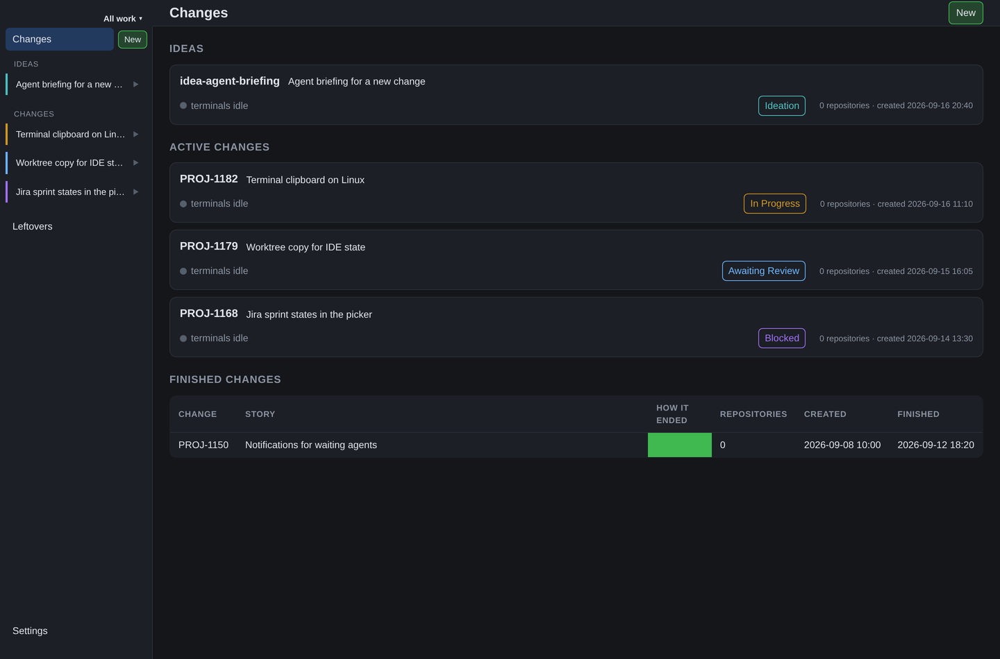

# The interface



## Navigation

The left column contains the workspace switcher, change overview, ideas, active changes and their
terminal windows. At the bottom sit Settings — a gear — and, to its right, the update icon: yellow
when a new version of the app is waiting, grey when there is none, and absent when this run
cannot update itself (see [install](install.md#updates)). The column is resizable and remembers
its width in the browser. On a narrow window it becomes an overlay drawer instead: a toggle opens
and closes it, as do choosing something, clicking the backdrop, pressing Escape, and widening the
window. While it is closed the content owns the window, rather than sitting below the column.

Ideas are separate from work in progress. An unfinished wizard appears as **New idea** or the
title you typed; opening it restores its draft. Only one destination is highlighted: a terminal
window, a change view, or the draft being edited.

Selecting a change opens its **Plan** — the first of its views. **Plan**, **Dashboard** and
**Review changes** are views of that change; terminal windows can also be opened directly from
the navigation column. Each view has a URL, so deep links, reload, and browser Back work.
Coming back to a change's overview — from a terminal window, or by opening the change again —
lands on the view you last had open there, within the running app: restarting opens the plan
again. Leaving Settings with unsaved edits asks first however you go — clicking or Back — see
[configuration](configuration.md).

Opening a dashboard does not start a terminal. A terminal starts or attaches when opened. The
new-window control creates another window, normally in the current window's working directory, and
makes it the current one. Background work that opens a window — an action run, a subagent — leaves
the terminal you are looking at selected.

## Settings

The settings page edits the config file directly; [configuration](configuration.md) documents the
keys and the scopes. Its scope bar holds **Global** and one tab per workspace, and the sections
below the tabs depend on the scope. Three of them are immediate actions rather than settings:

- **Remote access** (global scope): **Enable remote access** and the listener's **Port** ride the
draft and are written by **Save**. The Tailscale block publishes the listener to the tailnet —
**Publish to Tailscale** / **Stop publishing** — shows the published URL, and says why it cannot
publish (not installed, not connected, 443 already in use, or a 443 tree shared with another
handler, in which case it spells out the manual `tailscale serve --https=443 off`). See
[remote access](install.md#remote-access).
- **Devices** (global scope): create a short-lived, single-use **pairing code** — shown with its
countdown — and list the paired devices with **Revoke**. No token is ever displayed. See
[remote access](install.md#remote-access).
- A **remote workspace**'s **Context** tab (one workspace scope): ticking **Hosted on another
server** drops that workspace's local settings and shows its **Remote address**, **Remote
workspace** and **Device token** fields, a **Pair** control (a pairing code and a device name)
that runs the pairing against that server and fills the token, and — once paired — a picker of the
remote's workspaces. Changing the address or the remote workspace id while a token is stored warns
that the stored token no longer applies, and **Save** drops it, so the new target has to be paired
again. A remote workspace has no other sections, because its settings live on the server that
hosts it. Unticking the box switches it back to local; **Remove this context** deletes it. See
[workspaces](configuration.md#workspaces).

## Change views

A change's name, state, and actions remain accessible above its content. The **Plan** tab is
`PLAN.md` as Markdown source filling the tab — the markup stays visible, in a monospace face,
colored as an editor colors it. Tab indents in the editor (Escape, then Tab, moves focus on
instead). The text follows the file when it changes outside Corvi — an agent or an IDE editing
it — and when edits are in flight it asks before either version goes away. How far into the plan
you were is remembered as you move around, within the running app. The dashboard places notes
documents in the left column and status cards in the right; narrow windows stack the
documents first. Status cards load independently, so one slow integration does not block the
whole page. The **Subagents** tab shows the change's subagent sessions: each one's terminal, with its
conversation beside it — send it a message, restart an interrupted turn, reopen a closed window.
The selected subagent's own live terminal is shown there without moving the change's active
terminal; a subagent with no live window shows a placeholder rather than another shell, and
selecting one explicitly makes its window the active terminal. Returning to a view can show cached data while it refreshes.

The terminal page's row offers an **Actions** menu: the actions that fit the window you are on —
a prompt for the agent window you are looking at, a command for a plain shell — and then the
terminal cheat sheet. Each action is a file on disk; the **Actions** and **Subagents** pages list
these files and say where they live, with a **Repositories** block per active change: pick the
change, see what its checkouts carry, and create, edit or delete those files like any other. New
starts from a template — blank, or a copy of a built-in with its text previewed.

The overview and navigation show facts such as active pipelines, active terminal processes, and
review threads waiting on you. Colored indicators summarize status; the change's lifecycle state
is a separate choice, not inferred from those tools.

## Desktop and browser

The desktop application uses the same page as a browser, with native window controls,
notifications, dialogs, and external-link handling. Its header includes a draggable area;
interactive controls must remain clickable. On macOS the traffic lights occupy reserved space.
Renaming a change belongs in that change's action row, not in the window's general title area.

The context-menu setting controls the browser/desktop right-click menu, including the terminal's
own menu. See [terminals](terminals.md) for keyboard and clipboard shortcuts.

## Checking the interface

Developer commands:

```sh
bunx playwright install chromium
bun run shot
CORVI_ENGINE=webkit bun run shot
bun run app:permissions
bun run app:run
bun run app:drive
bun run app:drive --shot --notify
bun run app:sandbox 4090 --open
```

Screenshots use `CORVI_URL` (default `http://127.0.0.1:4000`) and are written under `shots/`.
Chromium is the primary engine because Electron uses it. Optional WebKit checks require a
working Playwright WebKit installation.

**Never test against the installed app.** Use isolated data and an explicitly owned development
server. A desktop sandbox must have its own identity; copying an installed bundle while retaining
its application identifier can address the wrong running app. Check each tool's target before
using it. Native window/notification behavior still needs platform-specific verification.

For automated suite setup and cleanup, follow the [testing guide](../guides/testing.md).
