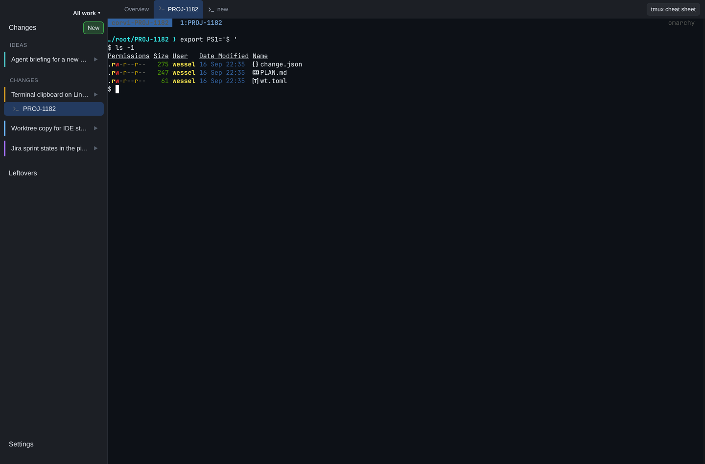

# Terminals



## Sessions and attachment

Each change can have a tmux session named `corvi-<change id>`, started in its change directory on
Corvi's own socket (`-L corvi`). Corvi attaches through node-pty and renders it with xterm.js.

Opening a terminal starts or attaches the session. Opening a dashboard does not. Closing the
page or restarting Corvi detaches the client without losing shells: tmux owns the persistent
session. Completing or cancelling a change explicitly closes its session before archiving it.

This persistence is not a promise to restore processes after a machine reboot or to resume an
agent conversation. Those are separate planned capabilities.

## Windows and navigation

Windows appear under their change in the navigation column. A default label uses the active
pane's directory and running command, such as `example-web - (vim)`. A plain shell adds no
command suffix. Renaming a window with `Ctrl-b ,` keeps your chosen name.

The new-window control, **Cmd-T** on macOS, or **Ctrl-Alt-T** on Linux creates another window in
the current window's directory. In a normal Chrome tab, Cmd-T remains a browser shortcut; the
desktop app can deliver it to Corvi. Keyboard focus stays with the terminal while switching windows.

Use normal tmux commands for windows and split panes; the terminal's cheat sheet lists common
shortcuts. Mouse mode supports scrolling through terminal history. A dot indicates output that
arrived while you were looking elsewhere.

## Agent status

Pi can report **working** or **waiting** in the active pane's `@agent_status` option. Corvi uses
that status instead of merely showing the process name `node`. An idle agent is not counted as
active work just because its process still exists.

The included reporter is installed into Pi with:

```sh
bun run extension:install
bun run extension:uninstall
```

These commands install Corvi's adapter into Pi; they do not install third-party code into Corvi.
The installation is a symlink to `pi/agent-state.ts`. Installing from another checkout repoints
the symlink, so do not run it as an incidental test. A real file at the destination is left alone.

The reporter marks `agent_start` as working, `agent_settled` as waiting, and clears its state on
session shutdown. Status belongs to the active pane; an agent in an inactive split is not shown.
When a pane disappears, its pane options disappear too.

## Keyboard and clipboard

- Shift-Enter, Ctrl-Enter, and their combination are sent using extended key sequences for
  applications that support them. Shift-Tab also passes through.
- Plain mouse selection belongs to tmux. Its copies reach the system clipboard through OSC 52;
  `Ctrl-b ]` still pastes from tmux's own buffer.
- Option-drag on macOS or Shift-drag on Linux selects through the browser terminal instead.
- macOS uses Cmd-C for that selection.
- Linux uses Ctrl-Shift-C / Ctrl-Shift-V; middle-click also pastes. Ctrl-C remains the shell's
  interrupt shortcut.

## Attention notifications

A transition from working to waiting can notify you when you are not actively looking at that
window. Selecting the same change is not enough to suppress it if another view/window is active.
Notification sound is configurable. With no connected page, there is no server-side OS notifier.
Several waiting windows can notify separately; each uses a stable window identity.

## Troubleshooting and safety

To inspect a session from another terminal, name Corvi's socket explicitly:

```sh
tmux -L corvi attach -t corvi-<change-id>
```

A blank browser terminal with a working tmux attachment points to the connection or rendering
path rather than lost shells. Check the correct server's logs and the browser console.

`CORVI_TMUX_SOCKET` can select a specific socket for isolated tests. Never use the user socket as
a fixture. Inside a Corvi pane, inherited `TMUX` points at that server: an unqualified
`tmux kill-server` there would terminate every Corvi session. Follow the contributor
[resource-safety rules](../guides/testing.md#resource-safety) when diagnosing test leftovers.
