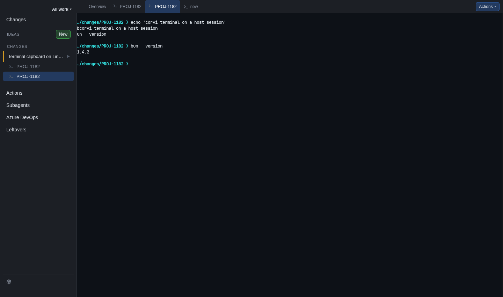

# Terminals



## Sessions and attachment

Each change's terminals are **host sessions** in the terminal host: one long-lived process per
Corvi state directory (`host.sock`) that owns the ptys. The page attaches over a WebSocket and
renders with xterm.js.

Opening a terminal starts or attaches a session. Opening a dashboard does not. Closing the page or
restarting Corvi detaches without losing shells: the host outlives the server that started it, so
the shells keep running and the next page resumes them (restoring the scrollback from the screen
the server keeps, which also survives a Corvi restart). Completing or cancelling a change
explicitly stops its sessions before archiving
it.

One window holds a session at a time. Opening the same terminal in a second window attaches there
and tells the first window it has been taken over: the first keeps its last screen, says the
terminal is open in another window, and offers **Take over** — which re-attaches it and, in turn,
detaches the second. This also covers two tabs on one machine; neither screen freezes silently.

Detached is not ended, and ended is not detached: a taken-over pane says the terminal is open in
another window and offers **Take over**, while a pane whose shell exited says only that this
pane's shell ended. A socket that closes on its own is neither — it is a connection state that
reconnects. The browser socket is not the shell: within one change, a hidden pane that stays
mounted may keep its attachment (switching between the change's views generally does not
reconnect it), but leaving the change or unmounting the pane can close the socket while the
shells and the server-side screen survive in the host and are resumed on the next attach. An
unavailable workspace or a retargeted target disconnects the pane; completing or cancelling a
change explicitly ends the sessions it owns (see
[completing a change](changes.md#completing-a-change)).

A remote workspace's terminals are unavailable with it: the pane says the workspace cannot be
reached, closes its browser connection, and typing goes nowhere until it recovers; the retained
windows and their last screens stay listed. Recovery re-attaches in place, without a reload.

A terminal that is starting or reconnecting says so; the pane does not claim the shells are lost.
A shell that exits ends only its own pane and says that there — the other terminals in the change
are unaffected. A slow startup or a temporarily unreachable server is a connection state, not a
lost session, so it recovers when the answer arrives without a reload.

This persistence is not a promise to restore processes after a machine reboot or to resume an
agent conversation. Those are separate planned capabilities.

A change in a remote workspace has terminals too, with one difference: its host session — the
shell, the CLIs, and any agent — runs on the **remote** machine. The page attaches to it through
the local client's gateway, and the scrollback the server keeps is the remote server's. The
window strip, the status channel, and attaching all work the same way wherever the session runs.

## Windows and navigation

Windows appear under their change in the navigation column and in the strip above the terminal. A
default label uses the window's directory, or the name an action or agent reported; an agent
window takes its own session name once it has one. There is no session manager underneath — a window
*is* a host session, and the strip switches between them. When more windows exist than fit, the
strip wraps to a second row instead of showing a horizontal scrollbar. The strip is capped at two
rows and scrolls once there are more; the **Actions** menu sits vertically centred in the strip.

The new-window control, **Cmd-T** on macOS or **Ctrl-Alt-T** on Linux, creates another host session
in the current window's directory. It becomes the current window. Work that opens a window in the
background — an action run, a subagent — does not: it leaves the terminal you are looking at
selected, so an idle shell is never taken over by something you did not open. Explicitly opening a
terminal — a strip tab, a notification, or a subagent entry — selects it. In a normal Chrome tab,
Cmd-T remains a browser shortcut; the desktop app can deliver it to Corvi. Keyboard focus stays
with the terminal while switching windows.

The terminal owns the screen: drag to select, the wheel or the scrollbar scrolls back, and the
right-click menu holds Copy, Paste, Select all, Clear, Find and Open link. A dot indicates output
that arrived while you were looking elsewhere.

## Agent status and the reporter protocol

An agent can say what it is doing in its session: **working** or **waiting** for you (a subagent
waits for its orchestrator), who it is, what the session is called, and the first sentence of its
last answer. Corvi uses that instead of the process name — `node` says nothing, and an idle agent
is not counted as active work just because its process still exists.

The facts are the reporter protocol. A reporter is a small plugin inside the agent; the two
included ones are `integrations/pi` and `integrations/opencode`. The reporter publishes through
the Corvi CLI (`corvi status working --name pi --session-name … --message …`), which posts to the
server; identity is the pty environment the terminal host seeds (`CORVI_SESSION_ID`), so any
Corvi session — an interactive shell, an action run, a subagent — reports the same way. A program
that cannot run the CLI may instead write the same facts as an OSC 1337 `corvi=<base64 json>`
sequence, which the host parses and the server treats as a fallback. Status belongs to a session,
not a pane; a crashed agent's status is cleared when its host session ends.

| Fact | Values | Meaning |
| --- | --- | --- |
| status | `working` \| `waiting` | working: a run is in flight or retrying. waiting: settled and idle — it wants you, unless it is a subagent, which wants its orchestrator (see [Attention notifications](#attention-notifications)). |
| name | `pi` \| `opencode` | which agent reports from this session. |
| session name | free text | the session's own name, once the agent has one. |
| message | free text | the first sentence (at most 180 characters) of the last answer. |

Corvi's window strip reads those facts (as the `@agent_*` window options the presenter declares),
through the CLI/HTTP store first and the host's OSC parse as the fallback: the session name
becomes the window's label, the status colours the icon and decides whether a notification is
owed (the edge from working to waiting, except for a subagent — see [Attention
notifications](#attention-notifications)), and the last sentence is the note beside the name. A
session whose reporter has not spoken — an old plugin, a plain shell — is presented as the
terminal it plainly is. Anything else may read the facts too (the `corvi status` endpoint): the
protocol is stated here for the included reporters, not as an extension mechanism for Corvi.

What marks each state, per reporter: pi's `agent_start` is working and `agent_settled` is waiting
(a retry or a compaction is not settled). For opencode, message activity and busy/retry are
working, and idle is waiting; a subagent's own child session says nothing about the window. For
both, an error that wants the user reads as `waiting`, and every option is cleared when the
agent's session ends.

The included reporters are installed into pi and opencode with:

```sh
bun run extension:install:pi         # or: bun run extension:uninstall:pi
bun run extension:install:opencode   # or: bun run extension:uninstall:opencode
```

These commands install Corvi's adapters into the agents; they do not install third-party code into
Corvi. Each install points at `integrations/<agent>/src` — its entry `index.ts` composing the
reporter (`agent-state.ts`), the subagent relay (`turns.ts`), and the CLI guide (`cli-guide.ts`, a
sentence about `corvi` in the agent's prompt inside a Corvi session and nowhere else) — in the shape
that agent's loader
resolves: pi resolves a module's imports beside the file it loaded, so its install is the
directory `~/.pi/agent/extensions/corvi/` (symlinks, entry at `index.ts`); opencode follows the
link to the entry and finds its modules at the real file, so its install is the one link
`~/.config/opencode/plugin/corvi.ts`. Older shapes are removed on install. Installing from another
checkout repoints the links, so do not run it as an incidental test. A real file at the
destination is left alone. pi picks a changed extension up with `/reload` or a new session;
opencode takes a restart.

An extension's own errors — a failed `corvi` command, a report that could not be published — are
Corvi's problem, not the agent's conversation, so they go to the app's log
(`~/.local/state/corvi/log`, the same file the app pipes the server's output into, seeded into
every pane as `CORVI_LOG`) instead of onto the pane's screen. Outside a Corvi session the
extensions fall back to stderr. The agent's own output is never touched.

## Keyboard and clipboard

- Shift-Enter, Ctrl-Enter, and their combination are sent using extended key sequences for
  applications that support them. Shift-Tab also passes through.
- The terminal owns the screen: drag to select (double-click a word, triple-click a line), and the
  wheel or the scrollbar scrolls back. The right-click menu offers Copy, Paste, Select all, Clear,
  Find and Open link; middle-click pastes. When a mouse-aware program (pi) is running, hold
  **Shift** (Linux) or **Option** (macOS) while dragging to select.
- Copy with Ctrl-Shift-C or the platform's command key (Cmd-C on macOS, Super-C on Linux), or the
  terminal convention Ctrl-Insert; paste with Ctrl-Shift-V or Cmd-V / Super-V, or Shift-Insert.
  Ctrl-C remains the shell's interrupt shortcut.
- Cmd/Ctrl-F finds in the terminal, Cmd/Ctrl +/-/0 changes the font size, and Cmd/Ctrl-click opens
  a link.

## Attention notifications

A transition from working to waiting can notify you when you are not actively looking at that
window. Selecting the same change is not enough to suppress it if another view/window is active.
A subagent never notifies: its settled turn is waiting for its orchestrator (`corvi subagent
await`, the Subagents page), not for you, so it raises no attention edge — the window strip and the
Subagents page still show its state. Notification sound is configurable. With no connected page,
there is no server-side OS notifier.
Several waiting windows can notify separately; each uses a stable window identity.

A change in a remote workspace notifies too. Its notice carries the source it came from, so the
toast names that server (`source · change`) and the banner and the click both keep it apart from a
local change that happens to share an id; clicking opens that remote change's window.

## Troubleshooting and safety

The terminal host owns every pty. Its socket is `<state dir>/corvi/host.sock` (the state dir is
`$XDG_STATE_HOME/corvi` unless overridden), and the window registry is `terminal-windows.json`
beside it. A blank browser terminal with a live host session points to the connection or rendering
path rather than lost shells; the pane's own starting/connecting/reconnecting state says which,
and a message that a shell ended appears only when the session really exited. Check the correct
server's logs and the browser console. Stopping Corvi and starting it again leaves the host and its
shells running by design.

Tests isolate themselves with their own state directory (`XDG_STATE_HOME`), so they never touch
your host. Follow the contributor [resource-safety
rules](../guides/testing.md#resource-safety) when diagnosing test leftovers.
